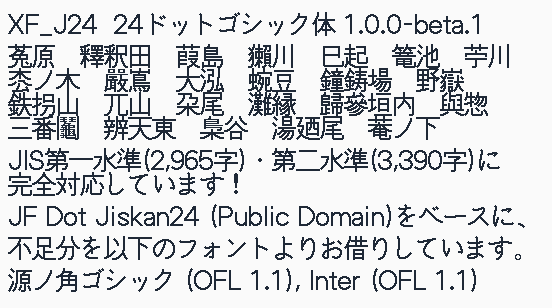

# XF_J24



XF_J24 is a 24px bitmap-style Gothic font based on [JF Dot Jiskan24 (Public Domain)](http://jikasei.me/font/jf-dotfont/). (Excluding half-width characters)

Glyphs not included in Jiskan24 are complemented with designs based on [Source Han Sans (OFL 1.1)](https://github.com/adobe-fonts/source-han-sans) and [Inter (OFL 1.1)](https://github.com/rsms/inter).

## Download / Installation

You can download the pre-compiled font files (`.otf`, `.ttf`, `.woff2`) from the [Releases](https://github.com/akashiyaki01c/XF_J24/releases) page.

1. Go to [Releases](https://github.com/akashiyaki01c/XF_J24/releases/latest) and download the latest font files.
2. Install the `.ttf` or `.otf` file on your OS. (or use `.woff2` in your `@font-face` CSS rules.)

## Included glyphs

This font includes the JIS Level 1 and JIS level-2 kanji sets.

> **Note:** Some glyphs are still undergoing manual design adjustments and modifications.

## License

This font is licensed under the [SIL Open Font License 1.1](LICENSE).
Feel free to use it for personal or commercial projects.

### Upstream Credits & Licenses

XF_J24 builds upon and incorporates designs from the following open-source projects:

- **[JF Dot Jiskan24 (only Full-width glyphs)](http://jikasei.me/font/jf-dotfont/)**: Public Domain
- **[Source Han Sans](https://github.com/adobe-fonts/source-han-sans)**: Licensed under [SIL Open Font License 1.1](https://scripts.sil.org/OFL) (© 2014-2021 Adobe)
- **[Inter](https://github.com/rsms/inter)**: Licensed under [SIL Open Font License 1.1](https://scripts.sil.org/OFL) (© 2016-2020 Rasmus Andersson)

## Repository Structure

- `XF_J24.kbitx`: Bits'N'Picas source file
- `fonts/`: Compiled font files (`.otf`, `.ttf`, `.woff2`)

## Development / Building from Source

Requires [Bits'N'Picas](https://github.com/pjb108/BitsNPicas) and [FontForge](https://fontforge.org/) installed on your system.

```bash
# Generate .otf, .ttf, and .woff2 into fonts/ directory
bash build.sh
```
